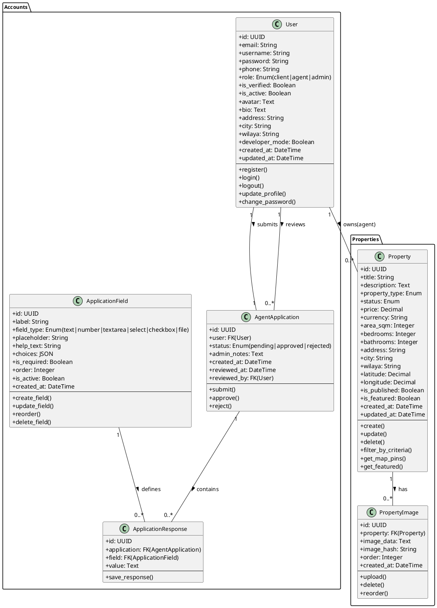
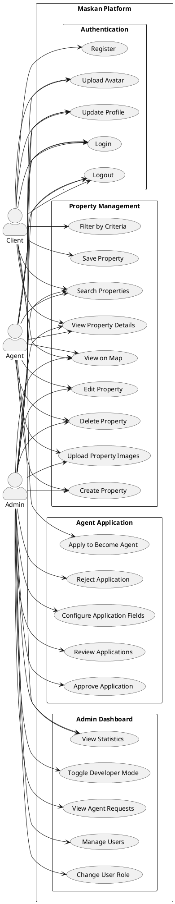
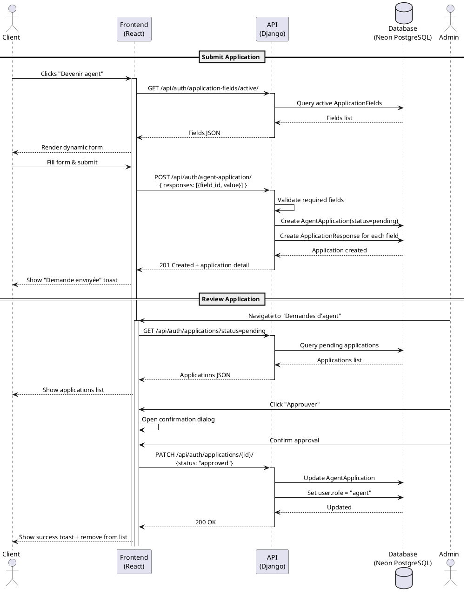
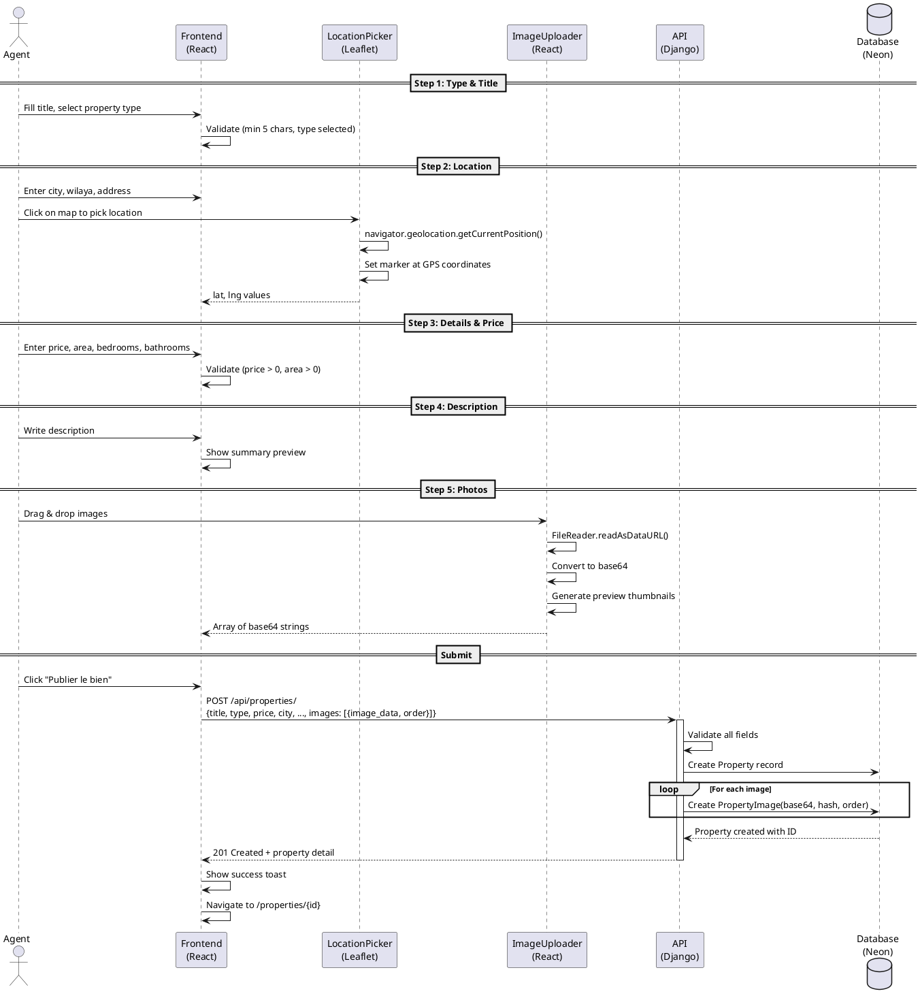
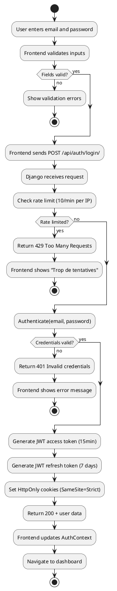
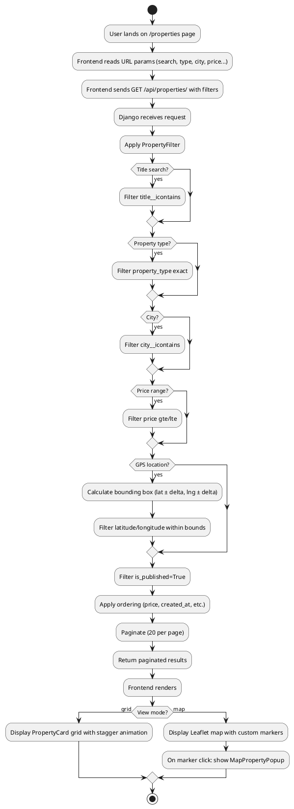
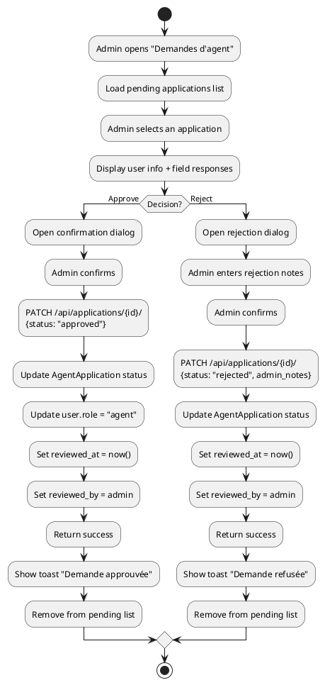
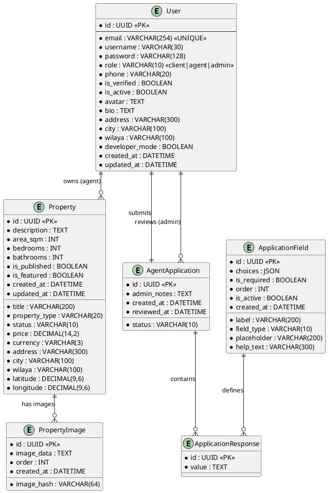

# Maskan — UML Diagrams & Database Structure

---

## 1. Database Structure

### Entity Relationship Overview

```
┌──────────────────────┐       ┌──────────────────────┐
│        User          │       │   ApplicationField   │
├──────────────────────┤       ├──────────────────────┤
│ id          UUID (PK)│       │ id          UUID (PK)│
│ email       VARCHAR  │       │ label       VARCHAR  │
│ username    VARCHAR  │       │ field_type  VARCHAR  │
│ password    VARCHAR  │       │ placeholder VARCHAR  │
│ phone       VARCHAR  │       │ help_text   VARCHAR  │
│ role        VARCHAR  │       │ choices     JSON     │
│ is_verified BOOLEAN  │       │ is_required BOOLEAN  │
│ is_active   BOOLEAN  │       │ order       INT      │
│ avatar      TEXT     │       │ is_active   BOOLEAN  │
│ bio         TEXT     │       │ created_at  DATETIME │
│ address     VARCHAR  │       └──────────┬───────────┘
│ city        VARCHAR  │                  │
│ wilaya      VARCHAR  │                  │
│ developer_  BOOLEAN  │                  │
│ created_at  DATETIME │                  │
│ updated_at  DATETIME │                  │
└──────┬───────┬───────┘                  │
       │       │                          │
       │ 1   1 │                          │
       │       │                          │
       ▼       ▼                          │
┌──────────────────────┐       ┌──────────▼───────────┐
│     Property         │       │ AgentApplication     │
├──────────────────────┤       ├──────────────────────┤
│ id          UUID (PK)│       │ id          UUID (PK)│
│ title       VARCHAR  │       │ user_id     UUID (FK)│ 1:1
│ description TEXT     │       │ status      VARCHAR  │
│ property_   VARCHAR  │       │ admin_notes TEXT     │
│ status      VARCHAR  │       │ created_at  DATETIME │
│ price       DECIMAL  │       │ reviewed_at DATETIME │
│ currency    VARCHAR  │       │ reviewed_by UUID (FK)│
│ area_sqm    INT      │       └──────────┬───────────┘
│ bedrooms    INT      │                  │
│ bathrooms   INT      │                  │ 1
│ address     VARCHAR  │                  │
│ city        VARCHAR  │                  │
│ wilaya      VARCHAR  │                  │
│ latitude    DECIMAL  │                  ▼
│ longitude   DECIMAL  │       ┌──────────────────────┐
│ agent_id    UUID (FK)│       │ ApplicationResponse  │
│ is_published BOOLEAN │       ├──────────────────────┤
│ is_featured  BOOLEAN │       │ id          UUID (PK)│
│ created_at  DATETIME │       │ application_id UUID  │ N:1
│ updated_at  DATETIME │       │ field_id    UUID (FK)│ N:1
└──────┬───────────────┘       │ value       TEXT     │
       │ 1                     └──────────────────────┘
       │
       ▼ N
┌──────────────────────┐
│   PropertyImage      │
├──────────────────────┤
│ id          UUID (PK)│
│ property_id UUID (FK)│
│ image_data  TEXT     │  (base64)
│ image_hash  VARCHAR  │
│ order       INT      │
│ created_at  DATETIME │
└──────────────────────┘
```

---

## 2. Class Diagram (PlantUML)



---

## 3. Use Case Diagram (PlantUML)



---

## 4. Sequence Diagram — Agent Application Flow (PlantUML)



---

## 5. Sequence Diagram — Property Creation (PlantUML)



---

## 6. Activity Diagram — Login Flow (PlantUML)



---

## 7. Activity Diagram — Property Search (PlantUML)



---

## 8. Activity Diagram — Agent Application Review (PlantUML)



---

## 9. Entity Relationship Diagram (PlantUML)



---

## How to Render These Diagrams

1. **Online**: Paste any `@startuml ... @enduml` block into [plantuml.com/plantuml](https://www.plantuml.com/plantuml)
2. **VS Code**: Install the "PlantUML" extension, then press `Alt+D` to preview
3. **CLI**: `java -jar plantuml.jar diagram.puml`
